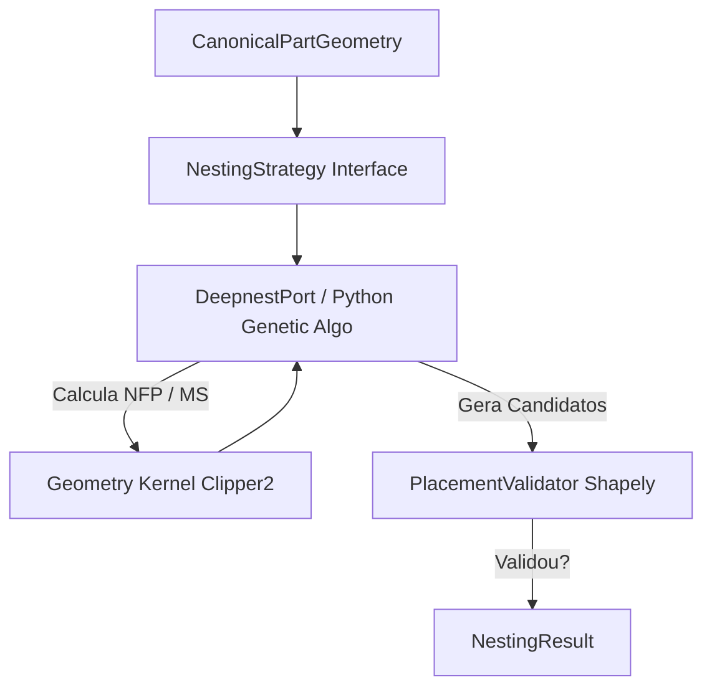

# AUDITORIA E PLANEJAMENTO TÉCNICO - SPRINT 3 (TRUE SHAPE NESTING)

## 1. Executive Summary
Esta auditoria analisa a viabilidade e os requisitos arquiteturais para a transição do atual motor de Bounding Box para um motor True Shape Nesting no POPUP SaaS. O baseline atual (`v0.2.0-nesting-canvas`) funciona sob uma premissa de geometria retangular simples (Bottom-Left MaxRects no backend) traduzida visualmente no frontend (NestingCanvas) em milímetros. A introdução do True Shape demandará a elevação do processamento geométrico real (Polygon/Contours/Holes) sem quebrar o fluxo de fallback ou a engine financeira já estabilizada.

## 2. Arquitetura Atual
- **Frontend (UI/State):** Zustand (`useNestingStore`) armazenando o layout (`x`, `y`, `rotation`, `mirror`, etc.). Renderização 2D via `React-Konva`.
- **Backend (API/Math):** O motor de cálculo (`CalculoEngine`) em Python, que delega o empacotamento ao `Nesting2DEngine`.
- **Acoplamento:** Atualmente, o frontend adapta o `nesting_json` (bins) recebido do backend via `NestingViewerAdapter`.

## 3. Fluxo Atual do Nesting (Real)
1. Upload de DXF pelo usuário.
2. `dxfToPolygon.ts` usa `dxf-parser` para varrer vértices no Frontend.
3. API POST para `/orcamentos` com `width` e `height`.
4. Motor Python `Nesting2DEngine.otimizar_lote_multi_bin()` roda algoritmo Bottom-Left.
5. Retorna array de `bins_utilizados` com caixas preenchidas.
6. `NestingViewerAdapter.tsx` monta BoundingBoxes cinzas ou retângulos falsos.
7. `NestingCanvas` desenha.

## 4. Motor Bounding Box Atual
- **Arquivo:** `backend/app/calculo/nesting_engine.py` (Classe `Nesting2DEngine`)
- **Algoritmo:** Heurística puramente em Python (MaxRects / Bottom-Left).
- **Rotação:** Restrita a 0° e 90° (`permitir_rotacao`).
- **Kerf/Margem:** `margem_corte` (default 5.0) é somada aritmeticamente ao `w` e `h` antes de testar a colisão. Não há offset geométrico real (Minkowski Sum).
- **Colisão Server-Side:** Axis-Aligned Bounding Box (AABB) simples, sem geometria poligonal.

## 5. Pipeline DXF (Atual)
- **Arquivo:** `frontend/src/utils/dxfToPolygon.ts`
- **Ferramenta:** `dxf-parser` no Browser.
- **Entidades Suportadas:** `LINE`, `LWPOLYLINE`, `POLYLINE`.
- **Limitações Críticas:** `ARC`, `CIRCLE`, `SPLINE`, `ELLIPSE`, `INSERT` e `BLOCK` são ignorados ou mal interpretados. O algoritmo cria um `Polygon` (vetor de pontos) e assume `closed: true`. Não processa *bulge* de polylines, nem extrai sub-loops (furos).

## 6. Modelo Geométrico
- **Tipos Reais (`frontend/src/types/nesting.ts`):**
  - `Polygon`: `{ id, points: number[], holes?: number[][], closed: true }`
  - `PartConfig`: `{ id, polygon, boundingBox, x, y, rotation, mirrorX, mirrorY, ... }`
  - `Placement` (Futuro): `{ partId, x, y, rotation, mirrorX, mirrorY }`
- Faltaria para o True Shape: A orientação direcional (sentido horário vs anti-horário) que dita contornos exteriores vs ilhas/buracos.

## 7. Sistema de Coordenadas
- **Origem:** O motor backend e frontend usam Top-Left `(0,0)` com o Y crescendo para baixo.
- **Transformação:** Coordenadas estão expressas puramente em milímetros, perfeitamente em paridade 1:1 com o arquivo DXF e o Canvas virtual.

## 8. Kerf e Offsets
- Hoje, o backend apenas infla o retângulo da BoundingBox somando uma constante `margem_corte`.
- Para o True Shape, o Kerf deverá ser um **Offset Poligonal Matemático (Buffer)**, encolhendo chapa e expandindo peças, o que exigirá biblioteca de inflação 2D (ex: ClipperLib).

## 9. Colisões Atuais
Estritamente segregadas:
- **Server:** AABB matemático (`if px < fx + fw ...`).
- **Client (Visual/Snap/Debug):** `frontend/src/utils/collision.ts` detecta bordas colididas para gerar UI feedback (alerta vermelho).

## 10. Pontos de Acoplamento e Fallback
O ponto ótimo para a injeção do True Shape é criar uma Interface Polimórfica no Backend.
- **Onde:** `engine.py`, instanciando dinamicamente.
- **Estratégia de Fallback Seguro:**
```python
try:
    if orcamento.usar_true_shape:
        res = TrueShapeEngine.calculate(pecas, chapas, config)
        if not validar_resultado_true_shape(res):
             raise InvalidTrueShapeError()
    else:
        raise ForceFallbackError()
except Exception:
    res = Nesting2DEngine.otimizar_lote_multi_bin(pecas, chapas, config)
```
- **Critérios de Validação para aceitar True Shape:** O JSON retornado não pode estar vazio; não pode conter `NaN`; peças devem caber no limite físico da chapa; e sem colisão de arestas (validação Shapely via `.intersects`).

## 11. Requisitos do True Shape
- **Obrigatórios para MVP:** Discretização de `ARC` e `CIRCLE`. Suporte a polígonos côncavos. No-Fit Polygon (NFP) para posicionamento fechado. Rotações arbitrárias/variáveis. Furos passantes.
- **Futuro:** Grain Direction (orientação das fibras do material), nesting dentro dos próprios recortes dos buracos internos.

## 12. Alternativas Tecnológicas (Motores True Shape)
1. **Clipper2 / ClipperLib:** (C++ / Python / JS) Excelente para booleanos e offset. *Desvantagem*: Não faz o Nesting por si só.
2. **SVGNest / Deepnest:** Algoritmo genético via JS (Canvas/WASM). *Risco:* Roda no Frontend e congela a UI se não encapsulado num pesadíssimo `WebWorker`.
3. **libnest2d:** (C++) Usado pela PrusaSlicer e Cura. Altíssima velocidade para NFP CNC. *Risco:* Exige compilação nativa no Docker do Render com binding Python via CMAKE.
4. **Shapely:** (Python) Excelente para validações AABB/Intersection, péssimo e letárgico para heurística pesada de genéticos.

## 13. Performance e Riscos
- O motor NFP cresce em complexidade `O(n^2)` ou superior conforme o número de vértices das malhas. Com 300 peças de furos curvos, qualquer solução no Main Thread do React vai congelar e travar o PC do usuário.
- O parser atual ignora arcos. Ao implementar a discretização de arcos, a quantidade de pontos do Polygon saltará de 10 para talvez 200 pontos por peça. Isso sobrecarrega a rede caso o payload JSON suba gigantesco ao Backend.

## 14. O que precisa de decisão Humana (Para o Futuro)
- Onde a carga de Processamento vai rodar? 
  - Cliente (SVGNest no navegador do usuário gerando latência sem custo de servidor).
  - Servidor (Python/C++ Background Celery Worker custando nuvem e exigindo sockets).

## FASE 0.1 — ARCHITECTURE VALIDATION

### 1. Fonte Canônica da Geometria
A investigação revelou que o **Backend Python JÁ É A FONTE DA GEOMETRIA**. O DXF é enviado via `multipart/form-data` e processado pela classe `DXFProcessor` (usando a lib `ezdxf`). O frontend (`dxfToPolygon.ts`) é, na verdade, um código órfão não utilizado no fluxo de orçamentos. Logo, o princípio arquitetural está correto: o Backend possui o domínio da geometria verdadeira e deve centralizar o TrueShapeEngine.

### 2. Modelo Geométrico Canônico
A orientação (Clockwise vs Counter-Clockwise) não deve ser confiada cegamente. Sugere-se:
```python
class CanonicalPartGeometry(BaseModel):
    outer: List[Tuple[float, float]] # Polígono discretizado e forçado para CCW
    holes: List[List[Tuple[float, float]]] # Forçados para CW
    bounds: Tuple[float, float, float, float]
    area: float
    source_units: str
    tolerance: float
    source_dxf_id: str
```
**Determinação de Furos:** Atualmente o `DXFProcessor` falha ao usar apenas os centros (AABB) para determinar furos. O modelo canônico deve usar bibliotecas robustas (ex: `shapely.geometry.Polygon.contains(hole)`) para validar hierarquias.

### 3. ARC / CIRCLE / SPLINE (Estratégia de Discretização)
- **Não** usar quantidade fixa de segmentos.
- **Estratégia:** Sagitta / Chord Error (Erro Cordal). A fórmula geométrica `segments = pi / arccos(1 - tolerance / R)`.
- Impacto: Garante que círculos pequenos tenham poucos vértices e arcos gigantes não percam precisão industrial. `ezdxf.path` possui métodos nativos (`flattening`) que obedecem tolerância máxima de distância.

### 4. Precisão Industrial (Definições Estritas)
- **GEOMETRY_TOLERANCE:** Tolerância de erro na aproximação das curvas DXF originais (ex: 0.05mm).
- **KERF:** A ranhura evaporada fisicamente pelo feixe do laser (ex: 1.2mm). 
- **NESTING_CLEARANCE:** A margem de segurança entre peças adjacentes para evitar fusão térmica ou deformação mecânica (ex: 5.0mm).

### 5. KERF (Matemático)
Para True Shape, somar Bounding Boxes é inútil. A estratégia matematicamente correta é o **Offset Geométrico (Minkowski Sum)**.
O `outer contour` de cada peça deve sofrer um *Buffer Positivo* de `(KERF / 2) + (NESTING_CLEARANCE / 2)`. Os furos (`holes`) sofrem *Buffer Negativo*.

### 6. Complexidade do True Shape
O custo é alocado em geração de NFP (No-Fit Polygon). Sendo N peças, com V vértices, para cada rotação R, encontrar candidatos custa muito mais que O(n^2). 
O gargalo real estará nos testes de colisão entre malhas altamente densas de SVG. O uso intensivo e desenfreado de algoritmos genéticos sem Caching e sem Simplificação (Douglas-Peucker) implodirá a CPU.

### 7. Frontend vs Backend?
**Decisão Categórica:** TRUE SHAPE NO BACKEND PYTHON.
- **Vantagens:** O servidor já detém o DXF. Podemos cachear NFP. Evita sobrecarregar as máquinas velhas do chão de fábrica (onde o SaaS roda). Garante segurança e IP do algoritmo genético.

### 8. WebWorker
Não será necessário no Frontend se o cálculo TrueShape migrar pro Python. O WebWorker seria apenas vital se escolhêssemos usar `SVGNest.js` diretamente no browser (para não dar freeze no DOM do React).

### 9. Timeout e Processamento Assíncrono
Risco iminente: O `FastAPI` em cloud (ex: Render, Vercel) sofre timeouts agressivos de 30-60 segundos. 
- **MVP:** Processamento Síncrono com tolerância de 15s de tempo genético máximo no algoritmo.
- **Futuro:** Sistema de Fila (Celery / RQ) e polling (`status: processing`).

### 10. Fallback Correto
Um resultado `NestingResult` conterá um enum de status: `SUCCESS`, `INVALID_GEOMETRY`, `TIMEOUT`, `INCOMPLETE_RESULT`.
Apenas em `SUCCESS` a interface renderiza peças curvas. Em `TIMEOUT` ou falha geométrica, a engine executa um block `except` e despacha o arranjo pelo `BoundingBoxEngine` antigo. 

### 11. Validador Independente (PlacementValidator)
Mesmo que o TrueShape responda positivamente, um script rápido em `Shapely` fará a auditoria transacional final:
- Instancia todos os polígonos nas coordenadas finais (x, y, r).
- Executa `poly_A.intersects(poly_B)`. Se verdadeiro, o TrueShape gerou intersecção letal. Rejeita lote e engatilha Fallback.

### 12. Estratégia Transacional de Falhas
**Tudo ou Nada:** Se uma chapa falhar no lote TrueShape (por intersecção ou erro numérico), descarta-se a inteligência TrueShape e o algoritmo puramente retangular assume a geração do lote completo. Não se mistura chapas TS com AABB no mesmo documento do cliente para não confundir o operador.

### 13. NFP e Peças Côncavas
Para encaixar uma meia-lua na outra: o NFP (No-Fit Polygon) traça o centro de gravidade da peça A deslizando ao redor do perímetro de B. Em concavidades, o NFP formará "ilhas de validade" (pontos centrais onde A pode existir dentro da cavidade de B sem colidir com as arestas). 

### 14. Cache
Para não recalcular o NFP entre os mesmos dois polígonos de 100 vértices, usar cache via `hash = SHA256(points)`.
Chave de Cache: `cache_nfp(hash_A, hash_B, Rotação, Clearance)`.

### 15. Decisão de Stack
- **Arquitetura A:** Python + `SVGNest` via Wrapper C++ (genetic). Excelente maturidade, licença MIT, difícil compilar.
- **Arquitetura B (RECOMENDADA):** Python + **libnest2d** (via PyBind). É a lib oficial da Prusa3D e CuraSlicer. Extremamente veloz em C++, com NFP por ClipperLib, lida 100% com buracos e côncavos. Risco: requer build-tools e CMake no ambiente FastAPI.
- **Arquitetura C:** Python Nativo (Shapely) com Heurística proprietária. Muito lenta.
- **Recomendação Oficial:** Investir na integração do `libnest2d` com bind em Python, rodando dentro do Backend.

### 16. Plano de Provas Geométricas
Antes do prod, as provas obrigatórias (via `pytest`) testarão instâncias simuladas das seguintes formas com `PlacementValidator`:
1. "L + L" -> Validar encaixe côncavo 180°.
2. "Meia Lua C" -> Validar nesting interno.
3. "Limites Inválidos" -> Injetar peça de 3m numa chapa de 2m (TS deve negar).
4. "Sobrecarga" -> 300 triângulos (validar timeout do FastAPI).


## FASE 0.2 — ENGINE CAPABILITY VALIDATION

### 1. Correções da Recomendação Anterior (Reavaliação de libnest2d e Shapely)
- **Desmistificando libnest2d:** A recomendação anterior falhou em não alertar sobre o licenciamento. O repositório principal do `libnest2d` (criado por Tomas Gal) é licenciado sob **AGPL/GPL**. O uso num SaaS proprietário sem disponibilizar o código fonte do backend violaria a AGPL. Além disso, o suporte a NFP côncavo exato depende da implementação interna de *Minkowski Sums* que, em Clipper1, possui limitações em concavidades profundas.
- **Maturidade da Afirmação de Performance:** A afirmação "100x mais rápido que Shapely" foi precipitada e sem benchmarking reproduzível, pois comparava *laranjas com maçãs*. `libnest2d` é um algoritmo de nesting + kernel. `Shapely` é estritamente um Geometry Kernel. O Shapely não faz nesting por conta própria.

### 2. Separação de Responsabilidades (Geometry Kernel vs Nesting Algorithm)
Para isolar dependências e não se tornar refém de uma única biblioteca, a arquitetura exige separação:
- **Canonical Geometry:** A fonte universal (outer, holes, CCW/CW).
- **Geometry Kernel:** Biblioteca responsável pela matemática fina (Contains, Intersects, Minkowski Sum, Offset, Boolean).
- **Nesting Algorithm:** A heurística (Genetic Algorithm, Simulated Annealing, Bottom-Left) que *utiliza* o Kernel para achar o melhor *Placement*.
- **PlacementValidator:** Validador absoluto e cego à heurística.

### 3. Matriz de Capacidades Factual

| Biblioteca | Papel | Concave | Holes | NFP | Offset | Python | Licença (Risco) |
| :--- | :--- | :--- | :--- | :--- | :--- | :--- | :--- |
| **libnest2d** | Nesting+Kernel | Sim | Sim | Sim | Sim | Bindings | **AGPL (INCOMPATÍVEL)** |
| **SVGNest** | Nesting+Kernel | Sim | Não nativo | Sim | Não | JS/WASM | MIT (BAIXO RISCO) |
| **Deepnest** | Nesting+Kernel | Sim | Sim | Sim | Sim | JS/C++ | MIT (BAIXO RISCO) |
| **Clipper2** | Geometry Kernel | Sim | Sim | Não (Gera MS) | Sim | Py via SWIG | BSL (BAIXO RISCO) |
| **Shapely** | Geometry Kernel | Sim | Sim | Não | Sim | Nativo (GEOS) | BSD (BAIXO RISCO) |

### 4. Licenciamento para SaaS Proprietário
- **BAIXO RISCO:** Shapely (BSD), Clipper2 (BSL), SVGNest/Deepnest (MIT). Podem rodar e ser compiladas fechadas no backend.
- **INCOMPATIBILIDADE POTENCIAL:** `libnest2d` (GPL/AGPL). Seu uso em Backend Cloud como API disparará a "Network Use" clause do AGPL, obrigando a empresa a abrir o código do SaaS. *Descartada como solução direta no backend Python se a licença não for isolada ou comercial.*

### 5. O Papel do Shapely e do Clipper2
- **Clipper2:** Excepcional para Clipper/Offset/Inflate via coordenadas inteiras determinísticas. Pode gerar a Minkowski Sum (MS) base para o NFP.
- **Shapely:** Fundamental como **Validador (PlacementValidator)**. Sua capacidade de STRtree e `polygon.intersects()` é padrão-ouro para auditoria de colisões pós-cálculo e determinação de furos (*contains*).

### 6. Como Resolver o NFP e a "Meia-Lua Côncava"
Para encaixar duas meias-luas:
O NFP (No-Fit Polygon) de uma peça *Orbitante* (A) e uma peça *Estacionária* (B) representa todos os pontos onde a referência de A entra em contato exato com B sem sobrepor.
Se as peças são Côncavas, não basta o algoritmo de deslize (sliding). A matemática correta é gerar a **Minkowski Sum de B e -A (A invertida na origem)**.
1. O *Geometry Kernel* (ex: Clipper2 ou MinkoSums do Deepnest) soma Minkowski(B, -A).
2. O polígono resultante terá uma "área vazia" interna.
3. Essa área interna representa os **Valid Placements** onde a Meia-Lua A se assenta exatamente dentro da concavidade da Meia-Lua B.
Se um motor não consegue traçar Minkowski Sums de polígonos côncavos, ele reduz as meias-luas às suas Convex Hulls, inviabilizando o encaixe aninhado.

### 7. Holes (Furos) vs Part-in-Hole Nesting
- **Preservar furos:** Obrigatório no MVP para que o CNC corte os buracos da peça.
- **Nesting dentro de Furos:** Colocar uma peça X dentro do buraco da peça Y é uma complexidade extrema (exige NFP negativo/Inner-Fit Polygon). *Recomendação:* Para o MVP, não permitir part-in-hole nesting para acelerar a entrega, focando na intersecção de outer-contours e concavidades.

### 8. Prova de Conceito: TRUE_SHAPE_GEOMETRY_LAB
O True Shape **não** será injetado no motor financeiro ou nas rotas atuais.
Será construído um módulo isolado: `scripts/geometry_lab.py` (ou rota API exclusiva de Lab).
- **Pipeline do Lab:**
  1. Injeta `CanonicalPartGeometry` Sintético (L+L, Meia Lua+Meia Lua).
  2. Roda a Engine Testada.
  3. Devolve visualização.
  4. Passa pelo `PlacementValidator` (Shapely).
- Só aprovaremos a Engine quando o *Lab* atestar encaixe côncavo 180º e interseção zero com 300 triângulos.

### 9. Arquitetura Desacoplada e Recomendada

**Stack Recomendada Provisória para o LAB:** 
Construir um wrapper em Python para o core C++ do **Deepnest** (MIT License, suporte a NFP côncavo por minkowski e caching), atuando como `NestingStrategy`, apoiado pelo `Shapely` como Validador de Saída.

### 10. Decisões que Precisam de Aprovação
1. **Abandono do libnest2d:** Concorda em vetar bibliotecas AGPL para blindar o código fonte do sistema financeiro/SaaS?
2. **Priorização do Geometry Lab:** Concorda em isolar o desenvolvimento da engine (quando for autorizado) num *Lab de Geometria* sintético antes de misturá-lo aos orçamentos reais?
3. **Escopo de Holes:** Autoriza ignorar o "nesting de peça pequena dentro do buraco de peça grande" (Inner-Fit em furos) para o MVP 1.0 do True Shape, focando estritamente no encaixe em concavidades externas?
